

# Summary of IACV Lecture 8-14

- [Summary of IACV Lecture 8-14](#summary-of-iacv-lecture-8-14)
  - [Lecture 8: Deep Learning](#lecture-8-deep-learning)
    - [Types of learning](#types-of-learning)
    - [Notation and basic steps](#notation-and-basic-steps)
      - [Features and Labels](#features-and-labels)
      - [Mapping - the goal of DL networks](#mapping---the-goal-of-dl-networks)
      - [Prediction computation](#prediction-computation)
    - [Sets of a DL model](#sets-of-a-dl-model)
    - [Learning step](#learning-step)
    - [Regression models](#regression-models)
    - [Basic perceptron model](#basic-perceptron-model)
    - [Multilayer perceptron - MLP](#multilayer-perceptron---mlp)
      - [Hidden layers](#hidden-layers)
    - [Training](#training)
  - [Lecture 9: Convolutional Neural Networks (CNNs)](#lecture-9-convolutional-neural-networks-cnns)
    - [Strides](#strides)
    - [Pooling - Achieving translational invariance](#pooling---achieving-translational-invariance)
    - [Stochastic gradient descent (SGD)](#stochastic-gradient-descent-sgd)
    - [Input normalization](#input-normalization)
    - [Over-fitting](#over-fitting)
    - [Putting it all together](#putting-it-all-together)
  - [Lecture 10: Recognition](#lecture-10-recognition)
    - [Weight update computation](#weight-update-computation)
    - [Going deeper](#going-deeper)
    - [Batch normalization](#batch-normalization)
    - [Residual Networks - ResNet](#residual-networks---resnet)
    - [Neural Architecture Search](#neural-architecture-search)
    - [Detection via Classification](#detection-via-classification)
      - [Feature Extraction](#feature-extraction)
      - [Sliding Windows](#sliding-windows)
      - [Integral Images](#integral-images)
    - [Boosting for feature selection](#boosting-for-feature-selection)
    - [Implicit Shape Model (ISM)](#implicit-shape-model-ism)
  - [Lecture 11: Deep Learning Segmentation](#lecture-11-deep-learning-segmentation)
    - [Semantic Segmentation](#semantic-segmentation)
    - [Transfer learning for semantic segmentation](#transfer-learning-for-semantic-segmentation)
    - [Hypercolumns (cool word)](#hypercolumns-cool-word)
    - [Fully Convolutional Networks (FCN)](#fully-convolutional-networks-fcn)
      - [Transposed convolutions](#transposed-convolutions)
    - [Conditional Random Field (CRF)](#conditional-random-field-crf)
    - [Dense prediction models](#dense-prediction-models)
    - [Receptive Field](#receptive-field)
    - [Dilated Residual Networks](#dilated-residual-networks)
    - [PSPNet](#pspnet)
    - [Attention / Transformer](#attention--transformer)
  - [Lecture 12 - Deep Learning Detection](#lecture-12---deep-learning-detection)
    - [Regions with CNN features (R-CNN)](#regions-with-cnn-features-r-cnn)
    - [Region Proposal Networks (RPN)](#region-proposal-networks-rpn)
    - [YOLO: you only look once](#yolo-you-only-look-once)
    - [Feature Pyramid Networks (FPN)](#feature-pyramid-networks-fpn)
    - [Overview on state-of-the-art object detection models](#overview-on-state-of-the-art-object-detection-models)
    - [Instance Segmentation](#instance-segmentation)
    - [Mask RCNN](#mask-rcnn)
    - [ROI Align](#roi-align)

## Lecture 8: Deep Learning
### Types of learning
We can differentiate between **supervised** and **unsupervised** deep learning. This is how they compare:

| supervised                               | unsupervised                          |
| ---------------------------------------- | ------------------------------------- |
| has task: detection, recognition, etc.   | no specific task                      |
| yields specific classification           | gives values for unspecified features |
| images with ground truth labels as input | images without labels as input        |

###  Notation and basic steps
#### Features and Labels
- $\mathbf{x} = \{x_1, x_2, ..., x_d \}$ represents **features**. These may be sets of *images*, *hand crafted features like HoG or SIFT* (**What are those?**), or any other type of observed information.
- $\mathbf{y} = \{x_1, x_2, ..., y_m \}$ represents **labels**. These will typically be the output of the model. Examples include object *categories*, *sharpened images*, *medical diagnosis*, etc.

Some examples of features and labels:

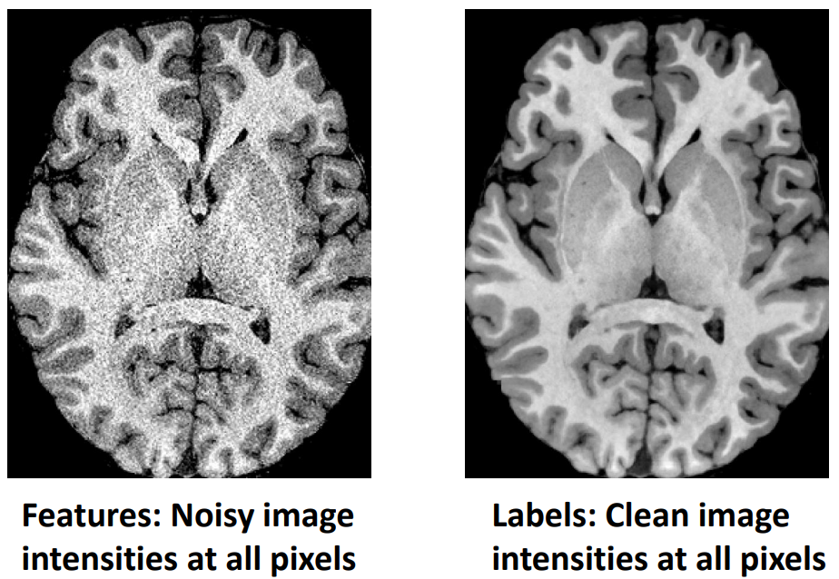

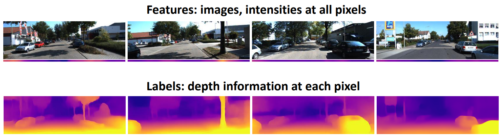

#### Mapping - the goal of DL networks
The basic goal is to achieve a mapping of features resulting from given *features* and *parameters*:

$$
\mathbf{y} = f(\mathbf{x}; \theta)
$$

The task of the NN is to find the best parameters to describe the above mapping &rarr; **find parameters that minimize some cost function.**

One example of a loss function is *regression* / the general p-norm:
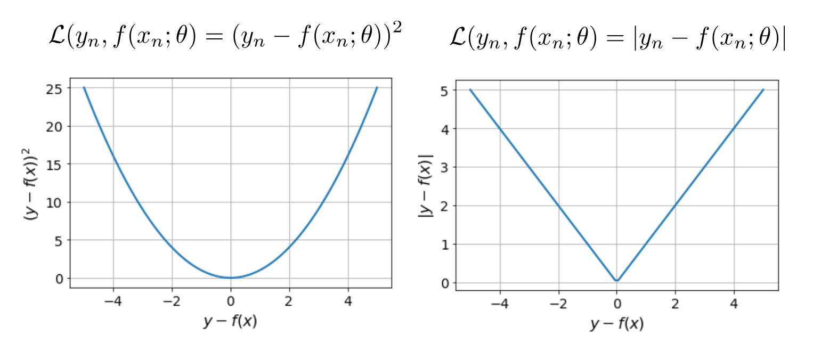

For classification tasks, *cross-entropy* is often used as a *cost function*. The lower the cross-entropy, the better the model matches the ground truth. Its mathematical definition is:

$$
H(p,q) = -\sum_{k \in \mathcal{C}} \log (f_k(\mathbf{x}_n; \theta)) \mathbf{1} (y_n = k)
$$

where

$$
\sum_{k \in \mathcal C } f_k (\mathbf x; \theta) = 1 \\
f(\mathbf x; \theta) = [f_{c_1}(\mathbf x; \theta), f_{c_2}(\mathbf x; \theta), ...] 
$$

This shit is confusing so put into words the cross entropy...
- decreases as prediction and ground truth become closer
- computes some product of the ground truth and the prediction

The sum of all classifications is 1 as each term represents a probability.

#### Prediction computation
To actually find the prediction (in math words: $\mathbf{\hat y} = f(\mathbf x; \theta^*$)), we can use some error computation.

Mean square error, mean absolute error look like this:
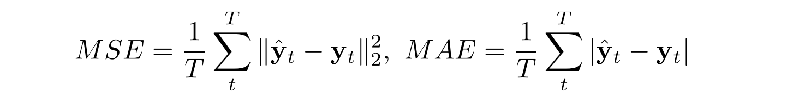

**TODO: Check when to use classification/cross entropy/MSE.**

For *classification tasks*, the prediction will match the $f_k$ with the highest value, i.e.:
$$
\mathbf{\hat y} = \text{arg}_k \text{max } f_k(\mathbf x; \theta^*)
$$

### Sets of a DL model
Typically, there will be three sets:

> **Training set**  
> It exists to compute the best model parameters. This is done by the algos, i.e. *pytorch* Size and quality of this set are crucial. 

> **Validation set**  
> Serves to determine the best hyper parameters.
> Hyper parameters include:
> - Type of model
> - Learning rate, batch sizes, etc.
>
> Ideally, there is no overlap:
> $$\mathcal D_{val} \cap \mathcal D_{training} = 0$$

> **Test set**  
> Used to estimate model prediction accuracy. **Must** have zero overlap:
> $$\mathcal D_{test} \cap \mathcal D_{training} = 0, \mathcal D_{test} \cap \mathcal D_{val} = 0$$
> **Important for single choice:**  
> Model parameters should **not** be changed based on test set accuracy.

### Learning step
During the learning process, the model optimizes the parameters $\theta$, using this procedure:
- Start with some initial values $\theta^0$.
- Determine direction that reduces loss &rarr; **gradient** computation.
- Update the parameters

The most common update step is using the negative of a gradient:
$$
\theta^{t + 1}_i = \theta^t_i - \alpha \frac{\partial \mathcal{L} (\theta)}{\partial \theta_i}
$$

The vector notation of this is:
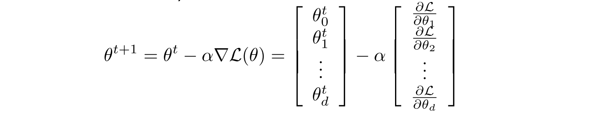

### Regression models
Simply consists of a linear or logistic model.

The **linear** model is a continuous mapping of feature to label:
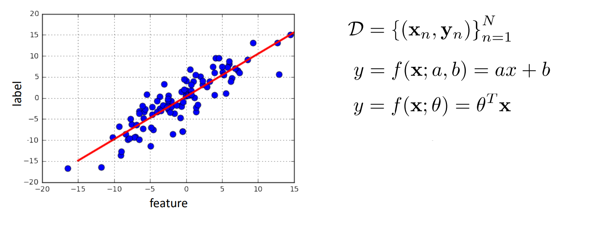

The continuous values of a lienar model go from negative to positive infinity. To use the model for classification, i.e. to get probabilites for *binary* underlying truths, this continuous space is mapped using the *sigmoid* function:
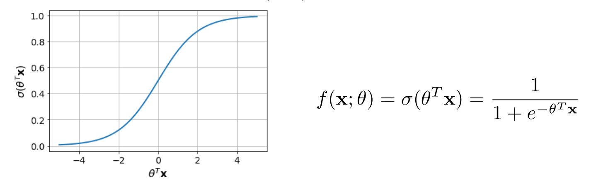

Through **learning using the cross entropy**, we can then find a model that predicts the binary decision the best:
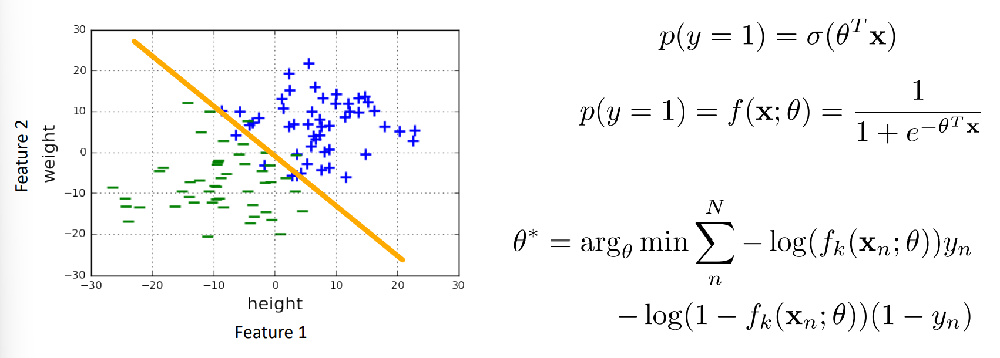

Where the model finds the ideal parameters for the orange line.

> **Alternative activation functions**  
> - The first alternative function to the sigmoid $\sigma$ is the *tangent hyperbolic*:
>   $$\sigma(a) = tanh(a) / 2.0 + 0.5$$
>
> For CNNs (see [Lecture 9](#lecture-9-convolutional-neural-networks-cnns)) more activation function emerged. They include:
> - Rectified Linear Unit (ReLU):
>   $$\sigma = \begin{cases} a, & a \geq 0 \\ 0, & a < 0 \end{cases}$$
> - Leaky ReLU (LReLU):
>   $$\sigma = \begin{cases} a, & a \geq 0 \\ \alpha  \cdot a, & a < 0 \end{cases}$$
> - Exponential Linear Unit (ELU):
>   $$\sigma = \begin{cases} a, & a \geq 0 \\ e^a - 1, & a < 0 \end{cases}$$
>
> 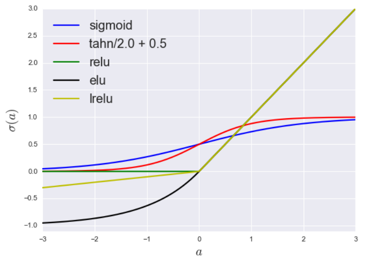

### Basic perceptron model
The **linear regression** combined with the **logistic function** leads us to the *basic perceptron model* that can be used for classification:
1. Activation : 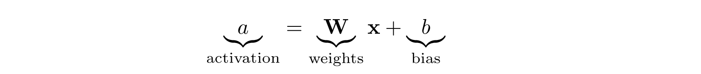
2. Binary decision - non linearity: 
   $$f(\mathbf x ;  \theta) = \sigma (a)$$

| Symbols                                                                                                                                                                                      |                           |
| -------------------------------------------------------------------------------------------------------------------------------------------------------------------------------------------- | ------------------------- |
| $\mathbf W \in \mathbb R^{1 \times d}$, The weights that the model learns. $d$ is the number of inputs, i.e. W x H x RGB for an image.    $b$ are the biases that are added non-linearly | 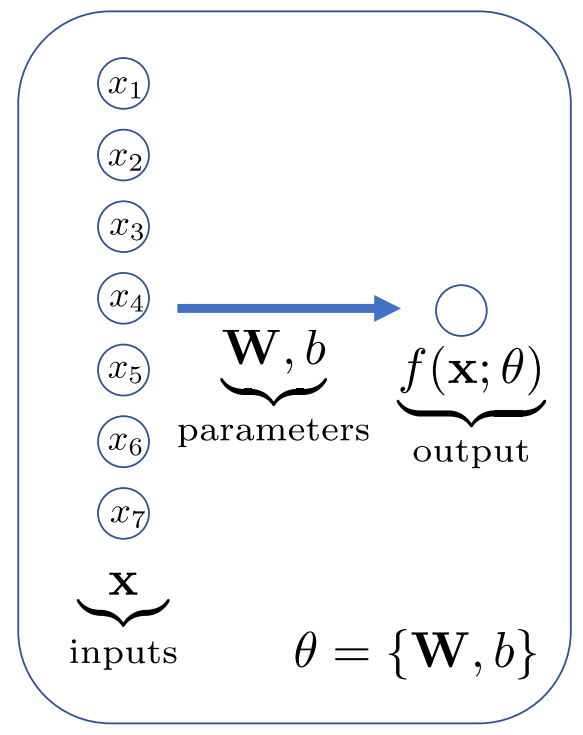 |

### Multilayer perceptron - MLP
Combining multiple of these layers can extend the basic perceptron to include non-linear relationships:
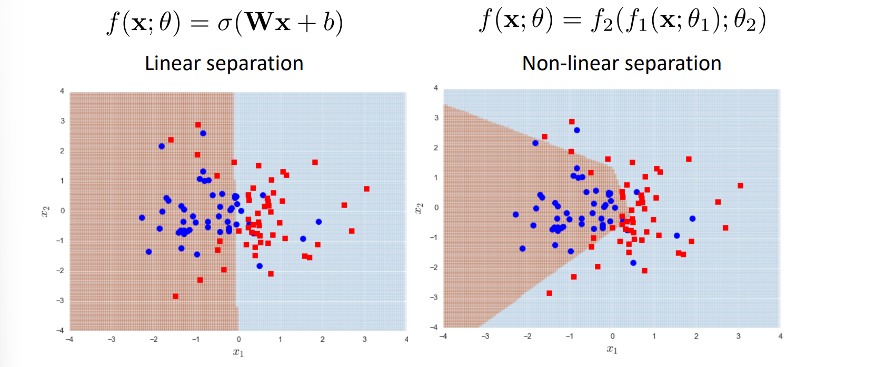

> **Note on dimensions**  
> $\mathbf W_1$ (initial layer) now has different dimensions compared to the basic perceptron; they now are $d_1 \times d$.  
> $\mathbf W_2$ has dimensions $1 \times d_1$, similar to the basic perceptron.
>
> The choice of $d_1$ (width of last layer) will influence the model in different ways:
> - $d_1 = dim$ only allows for non-linear transformations
> - $d_1 > dim$ maps to a higher dimension &rarr; useful for separating samples with complex class boundaries.
> - $d_1 < dim$ compresses the information. Becomes interesting for determining simple representation (like object classification).

Increasing $d_1$ allows a more complex shape of the decision boundary:
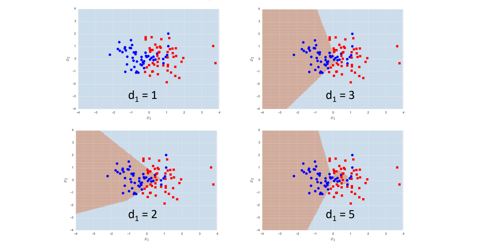

#### Hidden layers
Hidden layers can be added in between the initial and final layers. The are denoted with:
$$
h_l = \sigma(\mathbf W _l h_{l-1} + b_l)
$$

Increased numbers of hidden layers can "slice" the solution space into seprated areas:
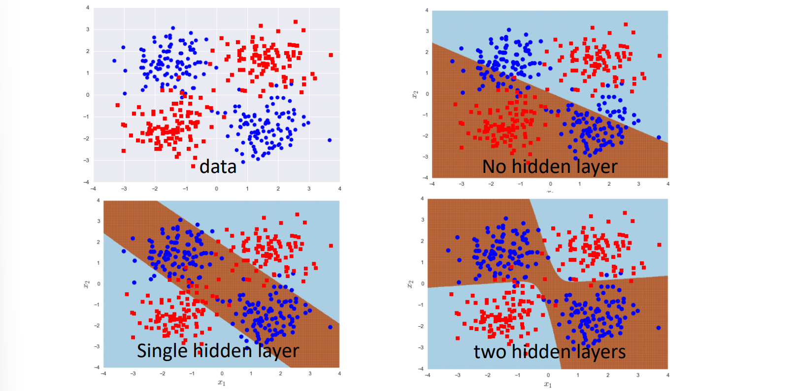

Choosing the depths and number of layers are **architectural** design choices and there is not yet a widely accepted generalaized approach to choosing these quantities.

An example of how a fully connected regression model fits data following a function:
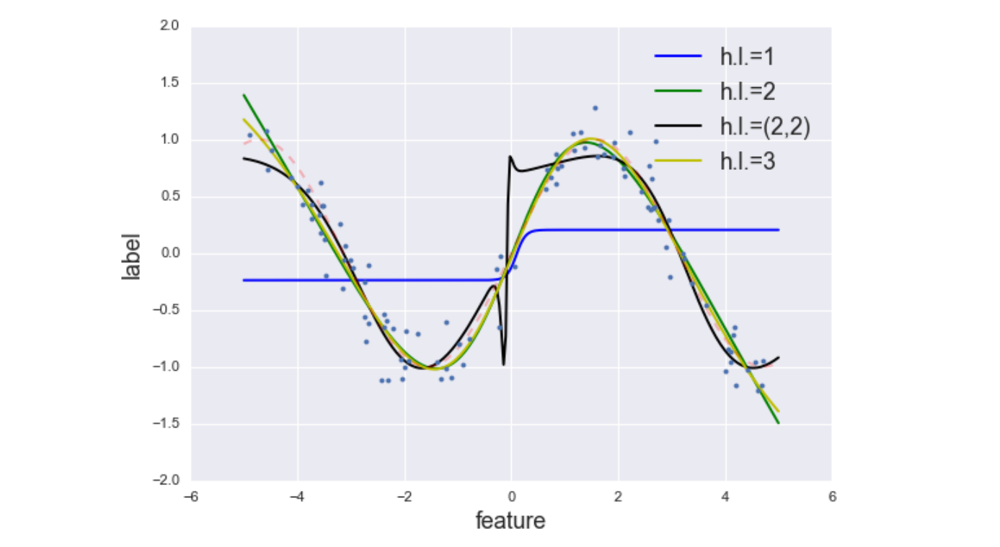

### Training
The steps in multilayer networks are categorized like this:
- All weights are *initialized* with some value. The most common type is *random initialization*. Others include heuristic approaches (like *Xavier* and *He*) that initialize around a mean of zero but add a random variance to it.
- In the *forward* step information/an input passes from the initial to the last layer
- In the *backpropagation* step the gradients are computed using the error for each layer. The function for the error of node $i$ of layer $l$ is:
  $$
  \delta_{l, i} = \left( \sum_k \delta_{k, l+1} w_{ki, l+1} \right) \sigma '(a_{l, i})
  $$
  (In words: the sum of all errors of the following layer, each multiplied by the connecting weight, multiplied with the activation function of the node in question.)  
  This fact is why we do **back**propagation.

## Lecture 9: Convolutional Neural Networks (CNNs)
The linear activation $a_l = \mathbf W_l h_{l-1} + b_l$ has three problems:
- Fully connected links lead to too many parameters (simple)
- Images are composed of a hierarchy of local statistics (**TODO: What does this mean?**)
- No translational invariance in images

This brings us to *convolutional layers*. There is just a small difference in the formula:
| fully connected                                                                                          | convolutional                                                    |
| -------------------------------------------------------------------------------------------------------- | ---------------------------------------------------------------- |
| $a_{l,k} = \sum_j w_{l, kj} h_{l-1,j} + b_{l,k}$                                                         | $a_{l,k} = \sum_j w_{l, kj} *  h_{l-1,j} + b_{l,k}$              |
| Each $h_{l-1, j}$ is a *number* corresponding to the value of a neuron.                                  | Each $h_{l-1, j}$ is an *image of neurons* (**TODO: ?**)         |
| Each $\mathbf h_l$ is a vector of neuron (a hidden layer), each $\mathbf a_{l}$ is a vector of activation. | Image $h_{l-1}$ and $a_l$ are linked by a *convolutional kernel* |
| Every combination of $h_{l-1,j}$ and $a_{l,k}$ has a separate $w_{l,kj}$                                 | $w_{l,kj}$ is a convolutional filter, $h_{l,j}$ are called **channels**                            |

To have an analogy between the multi layer perceptron and CNNs, understand this: each neuron of the MLP becomes a channel, the channels make up a layer (just like in MLP).

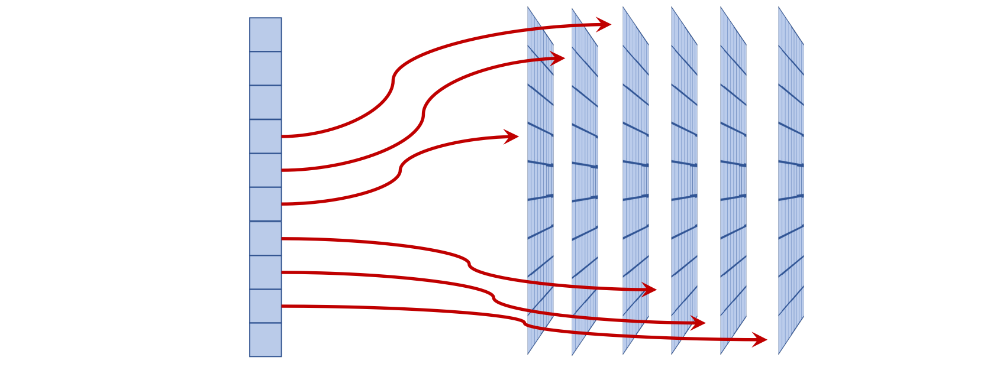
***Left:** vector of neurons in an MLP, **Right:** a convolutional layer consisting of multiple channels.*

As a consequence, the layers have a higher dimension, but fewer learnable parameters.

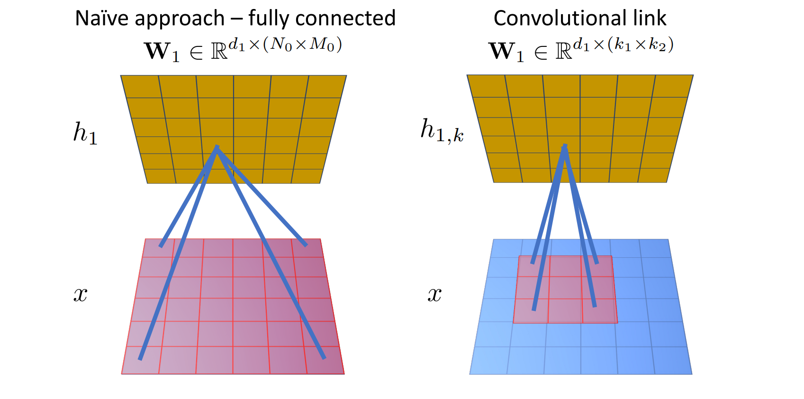

> **Some facts about CNNs**
> - Convolutional layers on their own are **not** translationally invariant.
> - Conv. layers are limited at the edges of images.

### Strides
Stride determines by how much the convolutional kernel is shifted for each calculation. This reduces the number of channels, but at the cost of information loss.

If used, it is normally limited to only size 2.

### Pooling - Achieving translational invariance
Pooling reduces an area of a channel into a single number. The choice of this number is up to design decisions and can typically is one of:
- Max-pooling - keep the highest value (most common)
- Min-pooling
- Averaging - linearly average the values

Pooling is usually applied with a stride equalling the size of the pooling kernel.

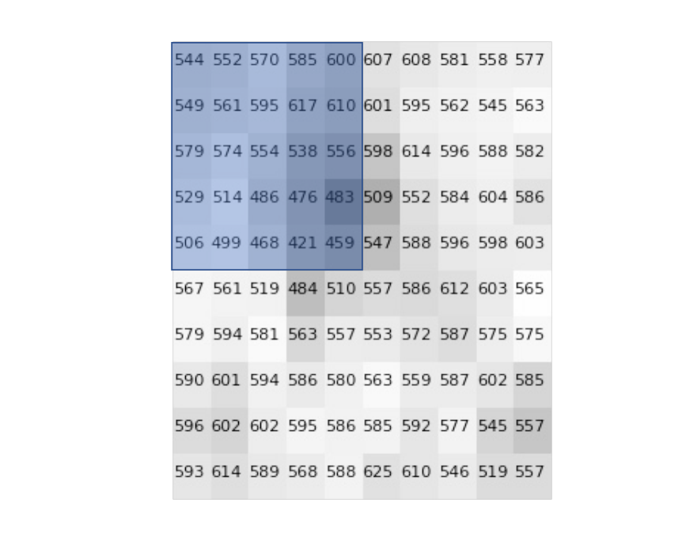
*Pooling of a channel. Max-pooling would lead to a value of 617 for the entire kernel.*

As evident from the image, pooling *reduces* the translational variance, but doesn't eliminate it. Additionally, it reduces the dimension.

By using pooling and strides, a small part of the final layers has a large "receptive area" - a large area of the input image which influences it. Visually this can be interpreted like this:
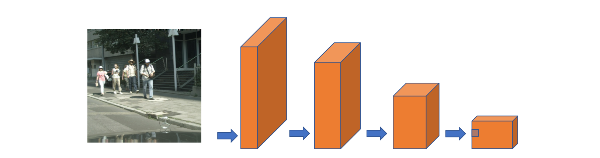

### Stochastic gradient descent (SGD)
To speed up CNNs, not the whole training data is used in every forward pass. Instead parts of it, a *batch* is randomly selected.

This "approximates" the gradient of every parameter by assuming the gradient of the batch $\mathcal B$ is close in value to the gradient of the whole set:
$$
\sum _n \frac{\partial \mathcal L_n}{\partial \theta_i} \biggr|_{\theta_i^t} 
\approx
\sum _{n_m \in \mathcal B} \frac{\partial \mathcal L_{n_m}}{\partial \theta_i} \biggr|_{\theta_i^t} \text{where }
$$

The parameter update step is then:
$$
\theta_i^{t + 1} = \theta_i^t - \eta \sum_{n_m \in \mathcal B} \frac{\partial \mathcal L _{n_m}}{\partial \theta_i}
$$

### Input normalization
Before feeding inputs to a CNN, it is very useful to normalize them. Some benefits include:
- Prevent numerical issues by limiting the range of the input values.
- Makes input more consistent. Images, for example, will can have their exposures corrected, to make the network invariant to over- or underexposure.
- It can allow for higher learning rates.

Some **examples** of normalization techniques:
- Min-Max:
  $$
  \tilde x = \frac{x - \text{min}_x}{\text{max}x - \text{min}_x}
  $$
- Mean-Standard deviation normalization:
  $$
  \tilde x = \frac{x - \mu_x}{\sigma_x}
  $$

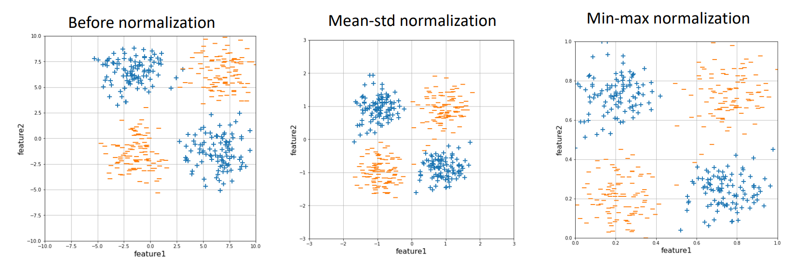

### Over-fitting
While designing a NN, it is likely to come across overfitting - where the model matches training data well, but not validation and test data. In general terms, this occurs if the model learns small, insignificant properties of that particular learning set &rarr; these properties are called noise.

An over-fit model is **not able to generalize**, but generalization is the whole point of NNs.

Visually, over-fitting can be interpreted as complex feature boundaries being placed due to outliers or circumstantial positioning of samples:
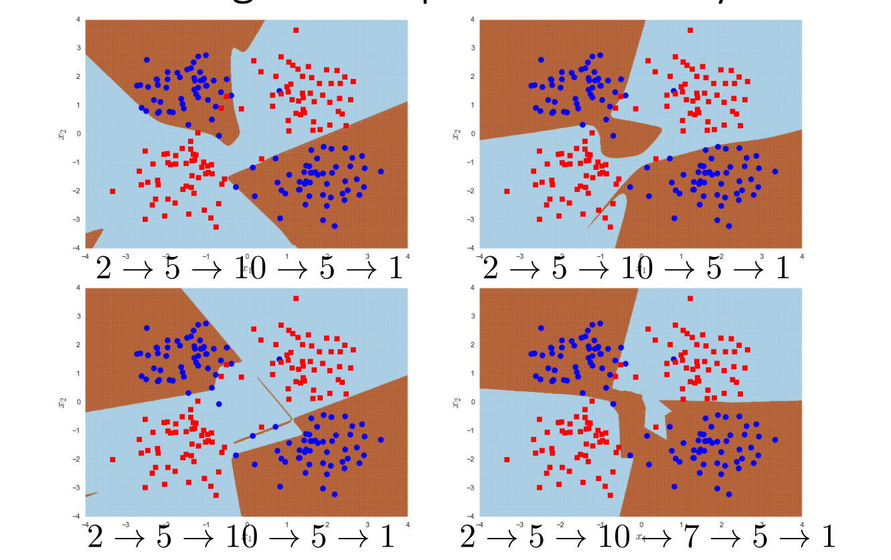

To reduce over-fitting:
- **Provide more test data**  
  This is usually the limiting factor, as data collection and labeling is expensive.
- **Reduce number of parameters**  
  By reducing the amount or depth of layers, there will be fewer parameters and the NN is less prone to fitting noise. This can lead to a performance loss though; as a consequence most state-of-the-art models are **over-parametrized** to get maximum performance.
- **Data augmentation**  
  Transform the input data (rotate, crop, etc.) to add randmoness to the input.
- **Regularization**  
  These are methods that reduce the variance (sensitivity to small changes in the input) of the model, while trying to keep the bias (deviation from ground truth) low. Generally these two measures are trade-off, and performance is likely to be reduced by applying these methods.  
  Some regulization methods include:
  - **Weight decay**  
    Also known as L2 regularization, this method reduces the magnitude of weights by subtracting a certain fraction of their L2 norm:
    $$\mathcal R (\theta) = \frac{1}{2} \sum \theta ^2_i$$
  - **Sparse weights**  
    Similar to weight decay, but using the L1 norm:
    $$\mathcal R (\theta) = \sum | \theta_i |$$
  - **Drop-out**  
    Randomly sets some activations to zero during training &rarr; those nodes will not be updated in that particular iteration. For using/testing the model, all activations will be on again. This incentivizes redundancies, which can help with generalization. When done with training, all weights need to be multiplied by the dropout factor, i.e. with 50% dropout during training, the weights are multiplied with 0.5 when 100% of nodes are active again.
- **Early stopping**  
  The stopping point can be added as a hyper-parameter. It can for example depend on the validation error and thus stop the training if the validation error start rising or stagnates.
- **Stochastic gradient descend (side benefit)**  
  Using SGD adds some implicit regularization, thus also reducing over-fitting. This makes sense intuitively; because only part of the training data is used for each batch, the particular noise of that batch will not be fitted strongly, as with the next iteration a new batch with a different noise pattern will be used.
- **Transfer learning**
  This term describes the usage of previously learned models and parameters and then extending or fine-tuning them. For example, taking [ImageNet](https://www.image-net.org/) and *retraining* it for a particular task. *Denoising* the input data using a NN is also a type of transfer learning.
- **Multi-task learning**
  Introducing more tasks can act as a type of *regularization*. One example would be "object recognition + distinguishing indoor/outdoor".

### Putting it all together
In the chapters leading up to this all essential building blocks of deep neural networks were mentioned. **LeNet** (see [Lecture 10](#lecture-10-recognition)) is a good example of using those building blocks:

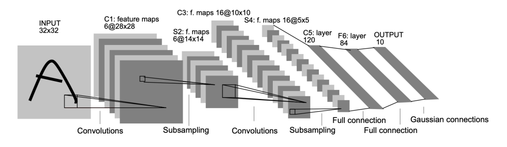
*Full LeNet neural network. **Subsampling** is pooling + downsampling. The **gaussian** layer computes unsupervised gaussian centroids (think K-means) that ideally represent meaning full labels. (**TODO**)*

## Lecture 10: Recognition
### Weight update computation
Lecture 10 shows a hands-on how computing the update step works.

$$
\begin{align*}
v_{i+1} &= 
\underbrace{M \cdot v_i}_{\text{momentum}} - 
\underbrace{\eta \cdot \left \langle \frac{\partial L}{\partial w} |_{w_i} \right \rangle_{D_i}}_{\text{gradient}} - 
\underbrace{\mu \cdot \eta \cdot w_i}_\text{weight decay} \\
w_{i+1} &= w_i + v_{i+1}

\end{align*}
$$

Symbols:
- $\eta$ - learning rate = 0.01 ($\epsilon$ is also commonly used)
- $M$ - momentum = 0.9
- $\mu$ - weight decay = 0.0005
- $D_i$ - dataset of the current pass, i.e. $\mathcal B$
- $\frac{\partial L}{\partial w} |_{w_i}$ - loss function gradient evaluated at current term

Using the numeric values:

### Going deeper
Meme interlude:

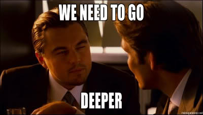

### Batch normalization
During training the distribution of weights of layers may shift from the mean. This is known as *internal covariance shift*. Deep networks amplify small values with propagation, so random shifts are problematic as they might make a layer dominant without intent.

Steps to compute the batch normalization:
1. Compute mean $\mu_\mathcal B$ of batch $\mathcal B$
2. Compute variance $\sigma_ \mathcal B ^2$
3. Normalize the batch:
  $$\hat x_i = \frac{x_i - \mu_\mathcal B}{\sqrt{\sigma_ \mathcal B ^2 + \epsilon}}$$
4. Scale and shift using lernable parameters $\gamma , \beta$:
   $$y_i = \gamma \hat x_i + \beta$$

As you can see, the normalization is not only centering the data, but potentially adding back a shift and scaling. As I understand it, it therefore does not remove any and all biases, but instead replaces the unwanted, uncontrollable shifts in values with a **bias that is learnable**.

Effects of batch normalization (they potentially apply, not necessarily):
- faster convergence
- more gradual gradient updates
- higher learning rates possible
- another form of regularization &rarr; helps avoid over-fitting
- helps with generalization

### Residual Networks - ResNet
Due to vanishing or exploding gradients the depth of neural networks tends to be limited. ResNet circumvented/lessened this issue by using so-called **residual blocks**. One such block includes a combination of convolutional, ReLU, or other layers, with a "shortcut" that allows the input of that block to skip it. Afterwards, that input is added to the output of that block:

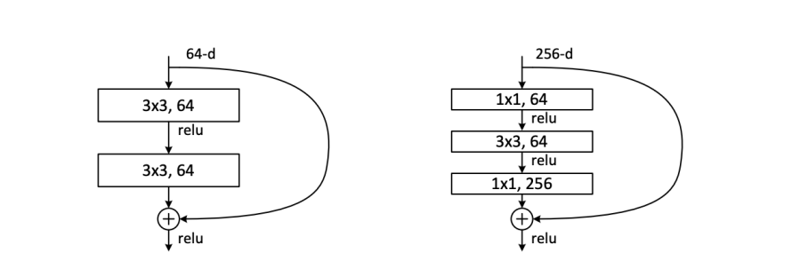

ReNet used a combination of *convolution* &rarr; *batch norm* &rarr; *ReLU* layers for one residual block.

What followed was more work building upon this, for ex. adding multiple parallel layers inside one residual block (ResNeXt). This building upon existing NN blocks is called **Neural Architecture Search (NAS)**.

### Neural Architecture Search
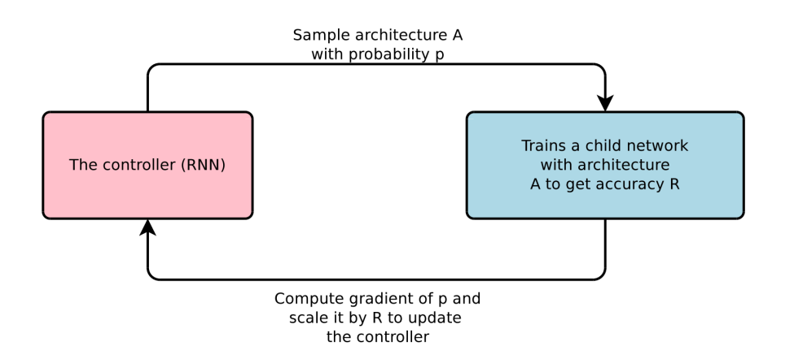

The accuracy of a NN is not differentiable &rarr; cannot simply compute its gradient and learn the optimal network architecture (NA). One method is NSA (**TODO**), but random search might work just as well.

### Detection via Classification
Basic idea:
- Gather data
- **Extract the features** in a sample of that data. This may be done with several methods but will ultimately offer multiple small windows:
  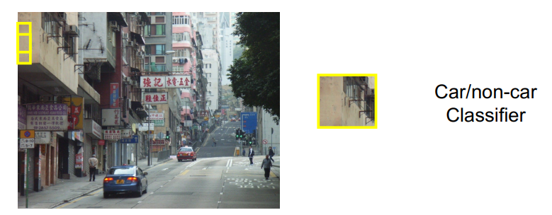
- Classify with a binary decision if the feature is what you're looking for (car in example)
- If it is car, the object is found. Else, take new window

The decision is crucial and may be hard to get right:
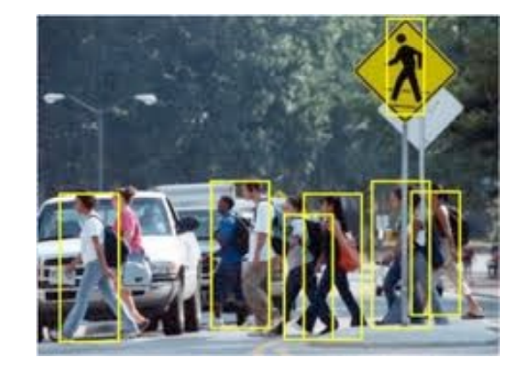  
*Are all the features that resemble a human shape actual humans?*

#### Feature Extraction
There are many methods of extracting features. Some of them were shown in earlier lectures. Additionally, some are outlined here:
- Histograms, describing the global appearance:
  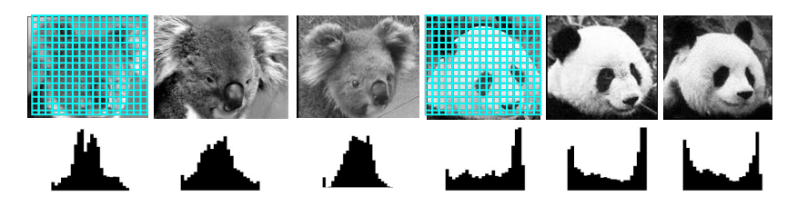
  These are, however, sensitive to shifts in appearance or exposure (koala in shade vs. in the sun can go from dark gray to light gray)
- Edge intensities and orientation:
  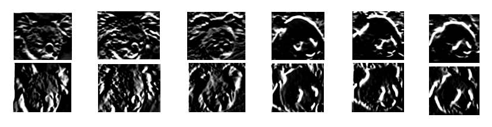

#### Sliding Windows
A computationally faster way of getting a measure similar to edge detection can be obtained using *sliding windows*.

With a **rectangle filter** (convolution where all kernel values are 1), we can very efficiently extract the pixel values of an image area.

#### Integral Images
A form of rectangle filters is the integral image, where the rectangle from (0,0) to (x,y) is computed:

  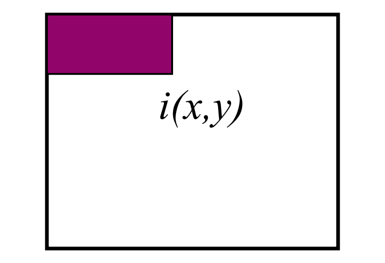
  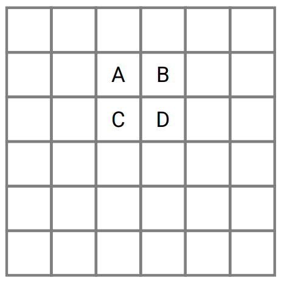

In mathematical form:
$$
S_{\sum}(x, y) = \sum_{x', y' = 0}^{x,y} i (x', y')
$$

There is a trick that makes this operation very fast to compute. With A, B, C, D being 4 adjacent cells we can use the fact that:
$$
S(D) = \underbrace{v(D)}_\text{original intensity} + \underbrace{S(B) + S(C) - S(A)}_\text{integral image values}
$$

With this the computation time of integral images is reduced to just $\mathcal O(M \cdot N)$

Using the method above, the **whole rectangle** is computed, i.e. (0,0), (x,y). To be able to compute **any rectangle**, you can geometrically see that we can use $S(R) = S(A) - S(B) - S(C) + S(D)$

  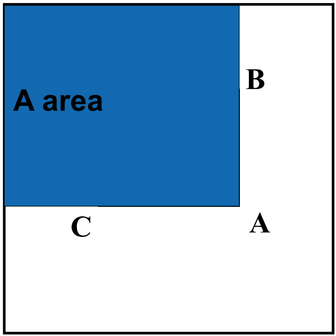
  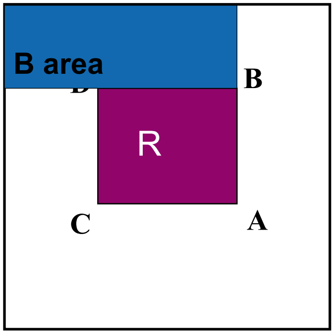
  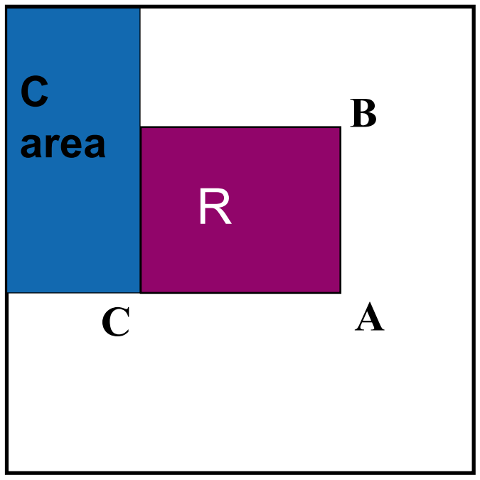
  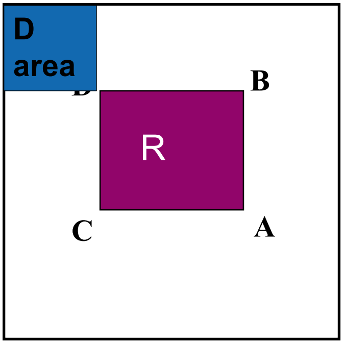

Now, how can we use these rectangle images? We can use differently sized rectangles as weak classifiers / to create features. Additionally, we can combine multiple rectangles into two/three/more-rectangle features:
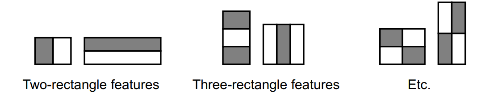

Individually, each of these is a *weak classifier* (high bias, low variance). However, if the weak classifier is just marginally better than random chance, multiples of it can form a **strong classifier**.

### Boosting for feature selection
Using multple weak classifiers, we can iteratively improve the overall result. The procedure is as follows:
1. Compute all classifiers and compute the optimal threshold value for each of them
  Example: Compute the sum of a two-rectangle feature for all training inputs. Once done, compute a treshold that groups all results into two separate categories. Find the optimal treshold.
2. Among them, find the classifier with corresponding treshold that achieves the lowest **weighted** training error (all samples have equal weight at the beginning).
3. For the next iteration, increase the weight of all samples that have been **wrongly classified** and repeat from step 1.
4. Use a combination of all previous classifiers as a **strong classifier**.

  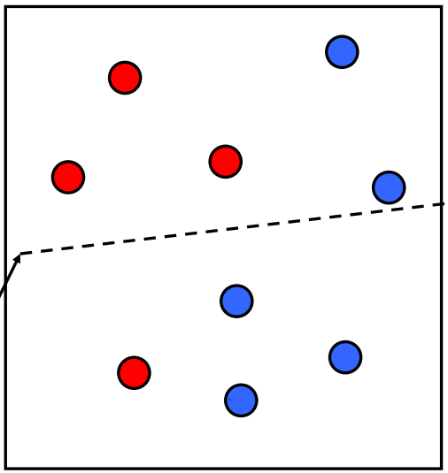
  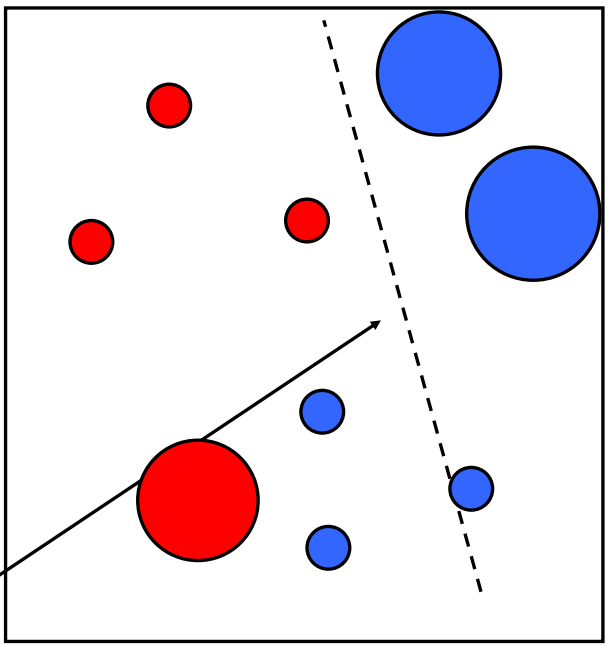
  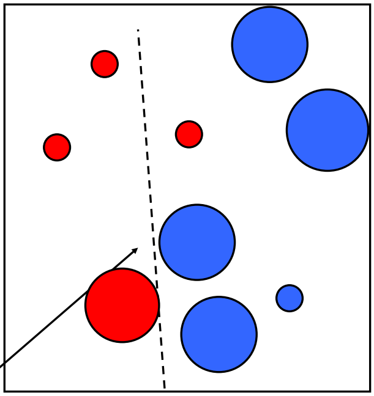
  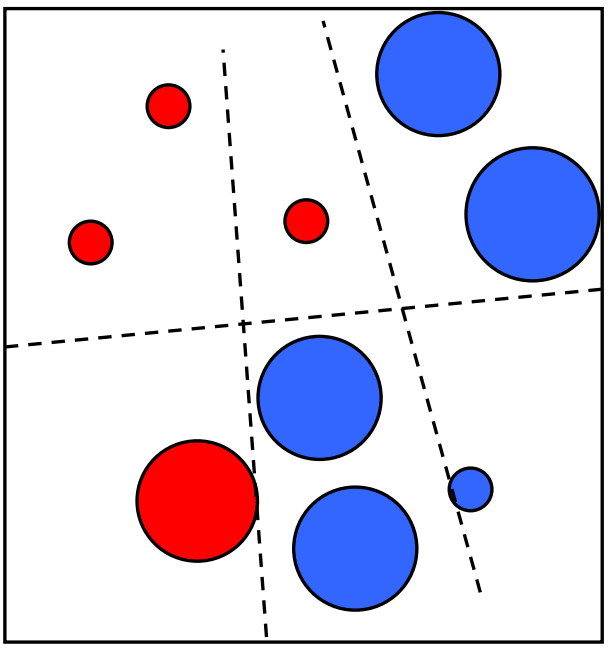

More concretely, this is how it works in the case of **AdaBoost**:
- Given a training set $\mathbf x = \{ x_1, x_2, ..., x_N \}$ and corresponding target values $\mathbf T$ (equaling -1 or 1 if classification match or not match),
- associated weights $\mathbf w = \{ w_1, w_2, ..., w_N \}$,
- $M$ classifier functions with tresholds $\theta_m$ and feature values $f_m(x_n)$:
  $$
  h_m(x) = \begin{cases} 
  -1, & \text{if } f_m(x) < \theta_m \\
  +1, & \text{otherwise}
  \end{cases}
  $$

we can iterate:
- Train a new weak classifier $h_m(x)$ based on the current weights $\mathbf w$.
- Adapt the weight coefficient for each training sample $h_m(x_n)$:
  - increase $w_n$ if $x_n$ was misclassified
  - decrease $w_n$ if $x_n$ was classified correctly
- Make prediction by combining all classifiers:
  $$
  H(\mathbf x) = sign\left( \sum_{m=1}^M \alpha_m h_m(\mathbf x) \right)
  $$

**Detailed Algorithm TODO**  

$J_m = \sum_{n=1}^N w_n^{(m)} \cdot I(h_m(\mathbf{x_n}) \neq t_n)$

### Implicit Shape Model (ISM)
ISM is about detecting objects not by their whole shape, but by parts / sub-shapes that make up the whole object. The sub-shapes are called **words**.

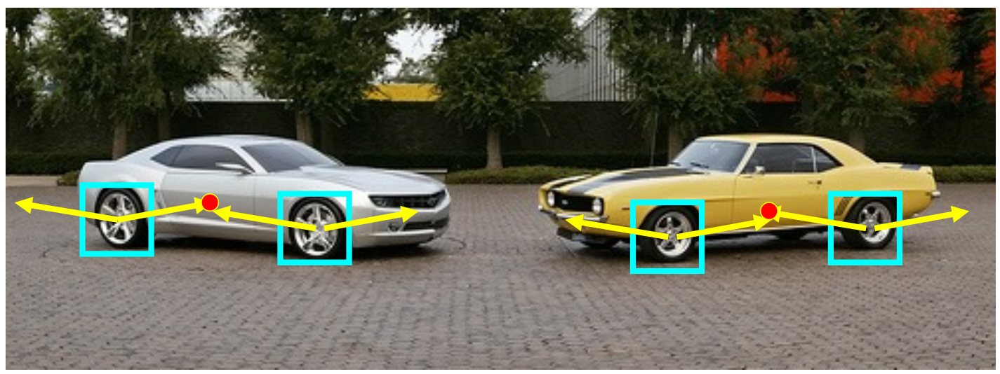
*A detection algorithm can detect cars by their wheels. The wheels are "words".*

The detection algorithm is trained on data that is typically called appearance codebook. The each image of the codebook contains:
- Centers of all objects to be detected
- Scale of the objects
- Images of the words making up the object

For a walking human, the training codebook would contain:

To detect an object the model goes through these steps:
- Partition the image into overlapping windows.
- For every window, check for matches between it and the codebook words (for ex. represent the window as a linear combination of the words with a word-histogram)
- Check for the correlation between the histogram of the object (above: histogram of a human) and the histogram of the window.
- If the correlation is above a certain threshold, classify as that object.

## Lecture 11: Deep Learning Segmentation
### Semantic Segmentation
A method of segmenting an image involves manually segmenting and labeling training data, and then training a network on it. Then, applying the model to unseed data (*inference*), a prediction based on the learned, perfect masks is made.

1-2 slides mention this and then there's nothing more on it.

### Transfer learning for semantic segmentation
> **Reminder on transfer learning**  
> Transfer learning is about using already learned parameters as the intial values of a model, and continuing learning using an extended, more specialized, or entirely different dataset. In this process the model might be modified or extended.

How transfer learning is often applied for semantic segmentation:
1. Train image classification model using large database (most often ImageNet)
2. Modify the model (model surgery):
  - Modify layers to not perform classification on large image areas, but on pixels instead (segmentation "classifies" every pixel)
  - Add fine tuning with pixel-wise cross entropy loss (**TODO**: what?)

Here, the key question arises: **How can we go from one label per *image* to one label per *pixel*?**

### Hypercolumns (cool word)
One way to extract more features on multiple levels is using *hypercolumns*. The idea is to not only use the final output of the model, but additionally "peak" into the model and save the activations of multiple layers. The purpose of that is to not only extract the high level final output, but add lower level data to it. This allows us to combine high level labels with down to pixel level details that are extracted from earlier layers, when the dimensions have not yet been compressed.

This is done by forming a single feature vector for each pixel, and then concatenating the spatially corresponding activations of each layer. Deeper layers will influence more pixel vectors, as they have a larger receptive field.

  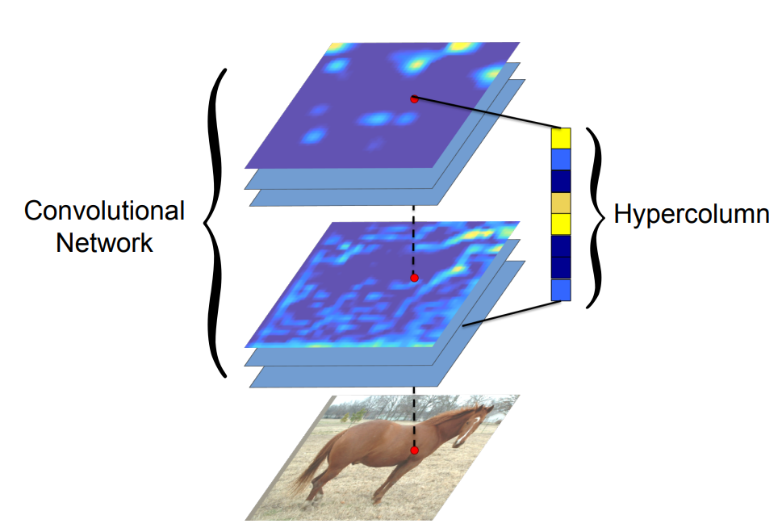

*Simplified illustration of a hypercolumn where it's visible that low resolution high level features (top/final layer) are combined with more granular earlier levels in a dashed vector.*

  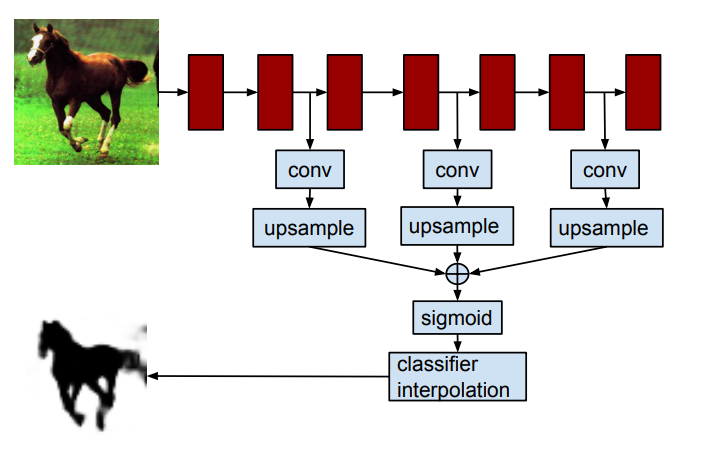
  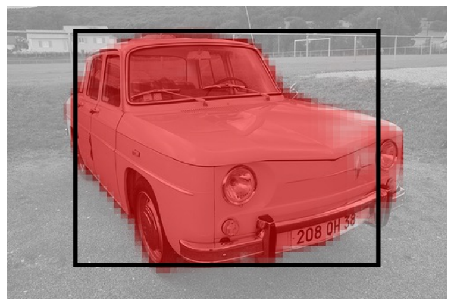

*Left: Representative activations between layers are picked. Additional convolutions are applied, upsampling applied (dimensions are most likely reduced compared to original image), and summed up. Right: the resulting output is good but has a reduced resolution.*

Slide 22 mentions that *"Convolution is spatially invariant"*. Now this contradicts some of the earlier lecture material. Below I added my own research and summary about the spatial properties of convolutional layers:

> **Clarification on convolutional layers**  
> The spatial invariance of a *convolutional layer* by itself has two separate, counterintuitive aspects:
> - The output image of a convolutional filter/kernel (one neuron of a conv. layer) is not spatially invariant, as the individual pixels of the output have receptive areas that are limited to the coverage of that filter (most often 3x3). In short: the location of a feature at the input influences its location at the output, thus changing the output.
> - One filter is, however, applied to the whole input image. Thus, no matter the location of a  feature, it will cause an activation at the output.
>
> Following animation is helpful in understanding the 3D nature of 2-dimensional convolution layers (3D convolutions exist but work differently):
> 
> *Animation from excellent source [animatedai](https://animatedai.github.io/).*
>
> The clarifications above apply to a **single convolutional layer**. A convolutional **network** (including multiple convolutions, stride, polling, etc.) as a whole can be spatially invariant due to the receptive area of later layers growing with each depth level.

### Fully Convolutional Networks (FCN)
The idea of these is to repurpose an existing classification network (low dimension output), and feed it images with a higher resolution than the images used for training. To achieve that, we need to do some *model surgery*:
- Replace fully connected layers with convolution layers (the fully connected layers are used for the classification and therefore reduce the dimension).
- Use **layer fusion** to combine semantic (category) information from deeper layers with the spatial information (down to pixel level) of shallower layers. In essence, this is exactly what segmentation is; assign high level labels to pixels.
- Improve the resolution of the mask using learned upsampling with **transposed convolutions**. As the information of deeper layers has reduced dimensions, these need to be upsampled to a higher resolution.

#### Transposed convolutions
These can be used for upsampling and are sometimes called *deconvolution* (though that wording is not exactly correct in our application). A transposed convolution is pretty much the reverse of the normal convolution; instead of a for ex. a 3x3 kernel saving the addition of a 3x3 area into a single pixel, a single pixel vlue is multiplied with a 3x3 kernel and saved in pixels of area 3x3.

As with the normal convolution, the kernel size and stride are adjustable. For ex. with a kernel of size 4 and stride 2, the output is upsampled with 2x. For kernel size 16 and stride 8, the upsampling is 8x. **TODO: how do we get 2x and 8x?**

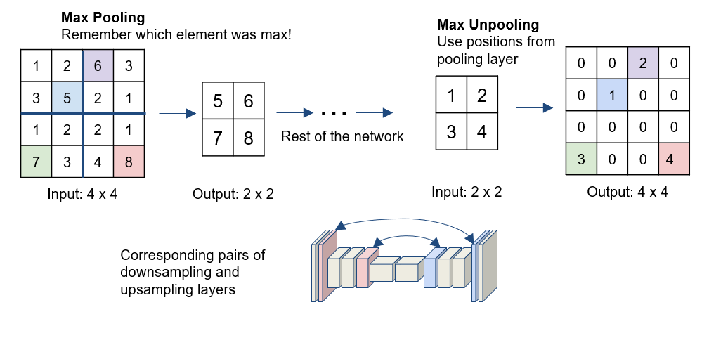

### Conditional Random Field (CRF)
A way to get sharper outputs is to apply an additional refinement step after the FCN. Lecture 11 slide 31 has a bunch of formulas with no explanation, don't know if exam relevant **TODO: check that**.

Slide 31 mentions **graphcut**. With it, the foreground can be extracted from images. This process is called **grabcut.** It is based on a cost function, the gaussian edge potentials.

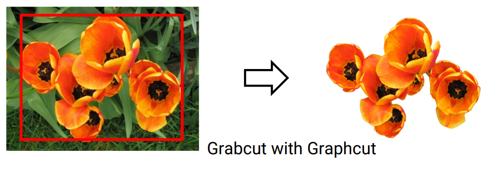

| Pros                             | Cons                                                                                                                      |
| -------------------------------- | ------------------------------------------------------------------------------------------------------------------------- |
| - very effective                 | - posthoc (additional) processing and tuning                                                                              |
| - results are sharp and detailed | - parameters must be manually tuned. Just the learning of the parameters is so introcate that it deserved it's own paper. |

Fortunately, traditional methods like CRF can be formulated using neural networks, as many iterative methods can be approximated by convolutional layers. With that, the hyperparameters of CRF would become learnable using backpropagation. One such attempt is **U-Net**.

U-net is similar to FCN, using up-convolution and feature concatenation to refine the output. What exactly these mean is not explained in the lecture.

  

<i>
U-net network structure.
</i>

### Dense prediction models
These models use something called **dilated convolution**. That is a convolution where the kernel is applied to a disconnected grid of pixels:

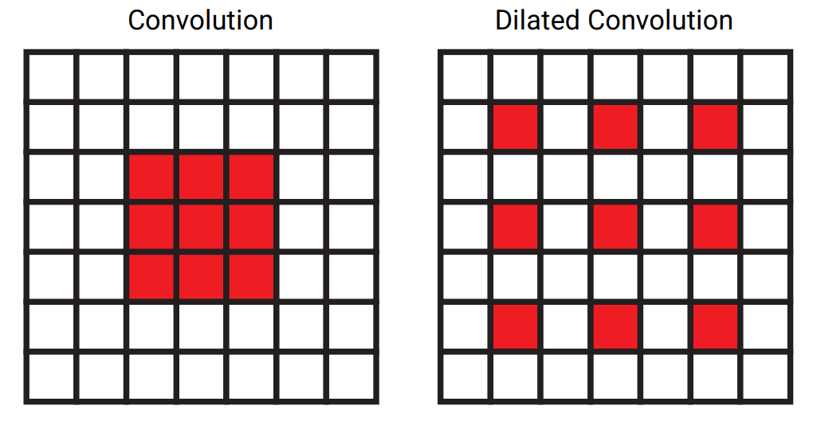

The *dilation* can be *combined with stride* to fill in the gaps/resolution loss caused by stride. The advantage of that setup is that through stride the receptive area increases and semantic features can be built. Normally, this causes a loss of resolution. Using dilation to fill in the gaps, the spatial structure and granularity of the *original structure can be better preserved while still having neurons for semantic features*.

How this look at a high level:

|     |     |
| --- | --- |
| 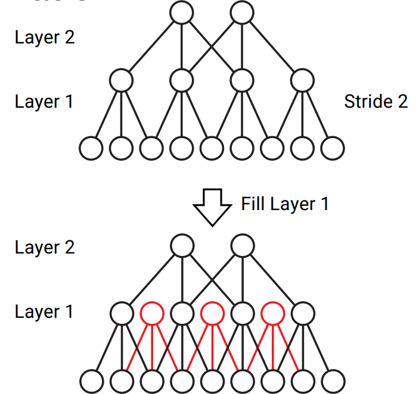   *1. Convolve twice using stride 2, and then fill gaps of layer 1 with dilation.* |  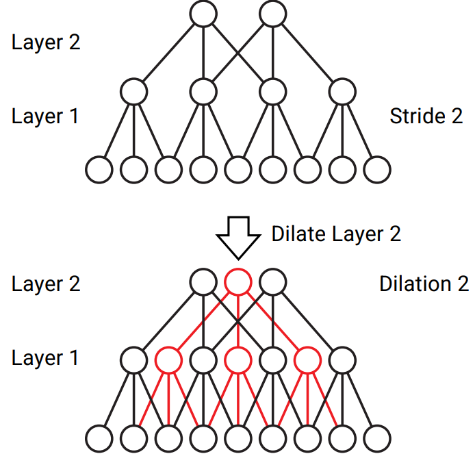   *2. Fill gaps of layer 2 by dilating twice.*  |

### Receptive Field
Just like with convolutions with stride, or with pooling, dilated layers (stride + dilation) have an increasing receptive area with increasing layer depth.

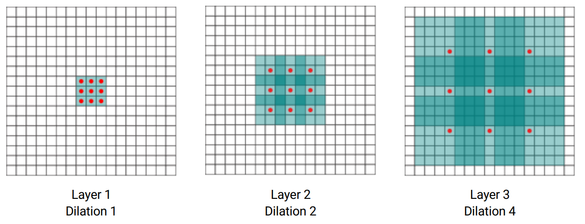
*Red: receptive fields of dilation,Blue-green: receptive area of convolution with stride 2*

With dilated layers, we choose the same stride as dilation, i.e. for stride 2 the gaps between the dilated pixels will be 1 because the gap between the kernel centers is also 1.

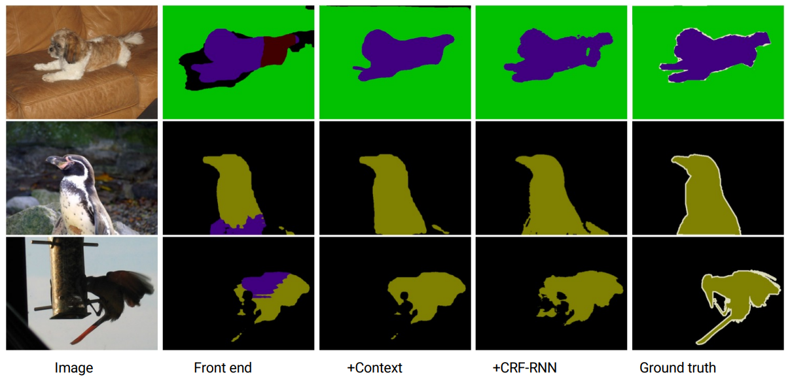

### Dilated Residual Networks
Thus far we went from **classification network** &rarr; **semantic segmentation**. What if, instead, we try to solve the classification task better by using semantic segmentation as a basis for classification?

  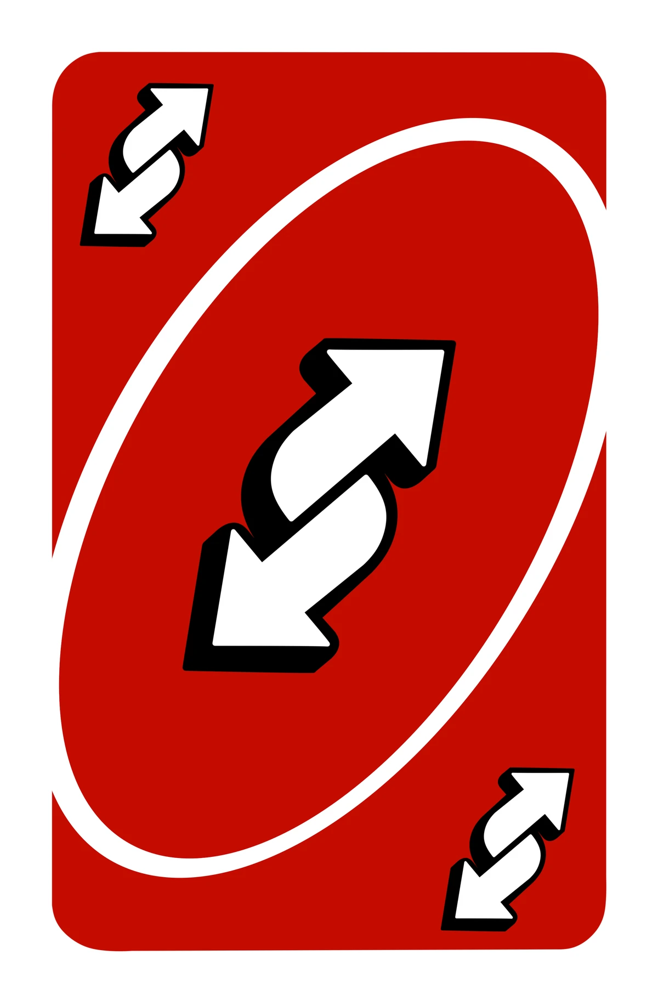  
  <i>Dilated Residual Networks vs. Fully Convolutional Networks</i>

The question here is: do high resolution feature maps benefit the classification task?

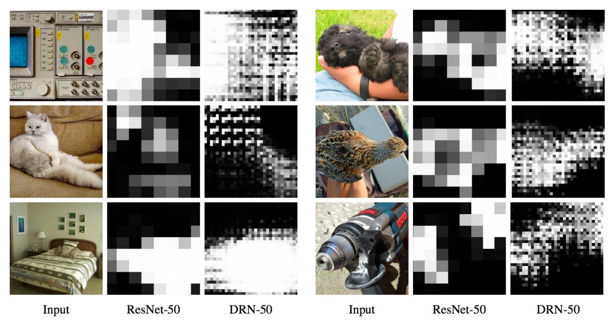
*ResNet-50 is a classic FCN, DRN is a FCN with dilation to preserver high resolution detail. Both are 50 layers deep and share many of the same layer architecture*

Comparing their performance it is clear that DRN outperforms the classic approach; high resolution feature maps indeed benefit the classification task.

  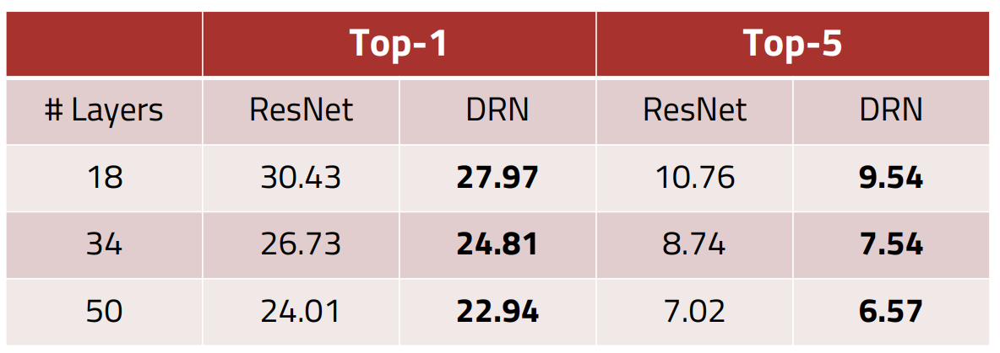

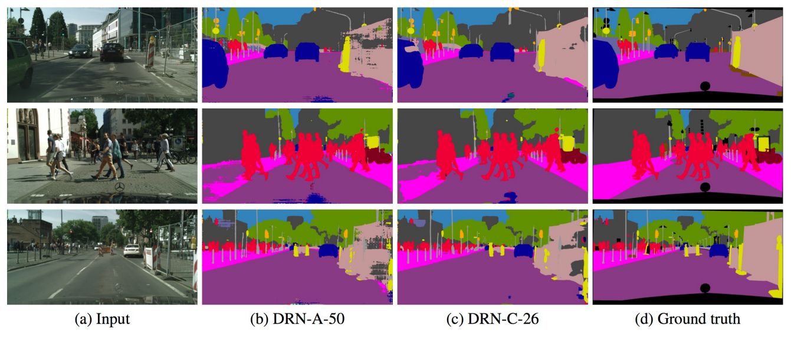
*DRN also offers very accurate segmentation masks.*

Applications of these NN include:
- Scene modification (for ex. makeup adding/removal)
- Image denoising

### PSPNet
- It uses a pretrained CNN with dilation to extract a feature map that is 1/8 the size of the original image.
- Then, the *pyramid pooling module* is concatenated to the output of the original CNN. 
  The *pyramid pooling module* uses a "4-level pyramid", where pooling kernels are used over the whole, half, and small sections of the original feature map.
- Finally a convolution layer uses the combined output to create a final prediction map.

The idea is that the pooling of differently sized parts of the features help with combining global cues of what the object is with local, detailed cues.

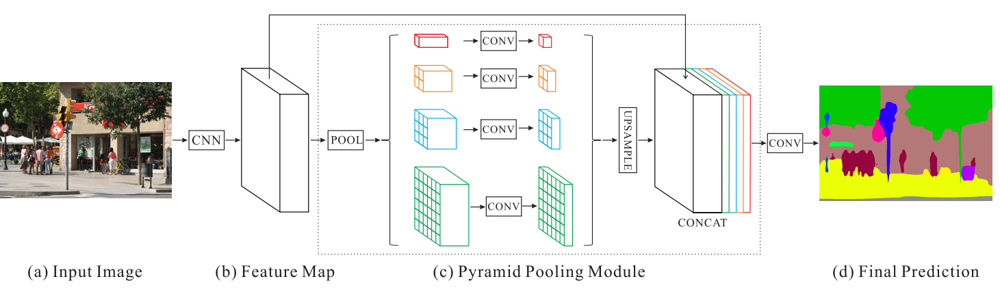

Additional tricks that were used:
- Variable learning rate **TODO: what are the symbols?**:
  $$
  \left( 1 - \frac{i}{max} \right)^p
  $$
- Data augmentation:
  - Random resizing
  - Random rotation
  - Random gaussian blur

PSPnet, of course, is even better than previous approaches:
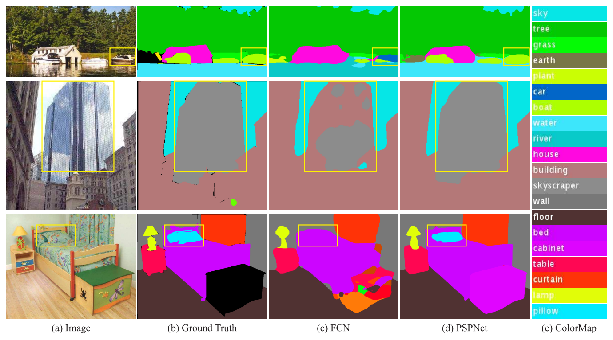

### Attention / Transformer
Attention (more recently called transformer) is used for modeling temporal sequences (videos) as well as for combinging low level with high level features, like dilation. It is an ongoing area of research.

## Lecture 12 - Deep Learning Detection
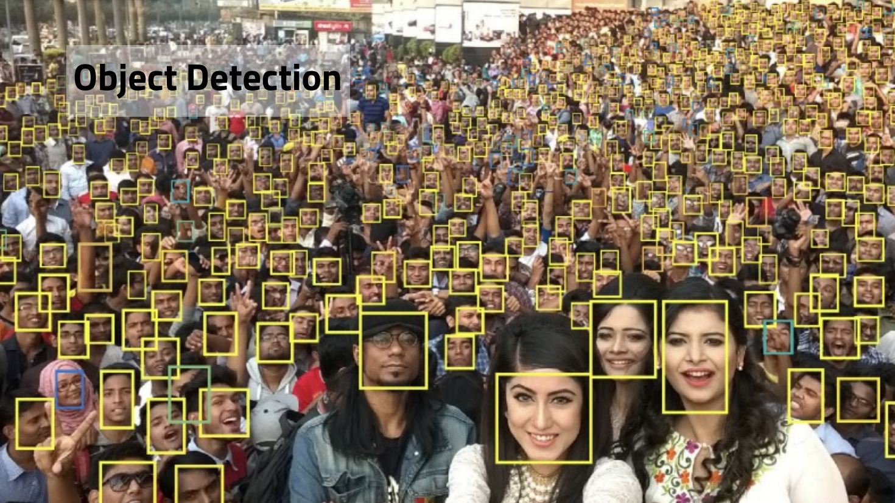

What we already saw was **detection via classification**: Sliding window over whole scene with a binary classifier. This requires a lot of computation, as most of a scene has to be evaluated only to detect one potentially small feature.

### Regions with CNN features (R-CNN)
R-CNN uses a NN to extract regions of interest. These output regions are then classified using another NN.

  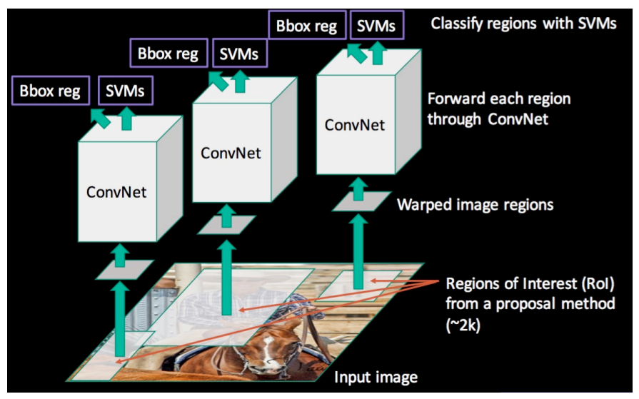  
  <i>Architecture of R-CNN.</i>

This model is very intensive, however. (200GB+ of data, 3 days of training, testing take 47s per image). A paper improved upon this and introduced *Fast R-CNN*.

  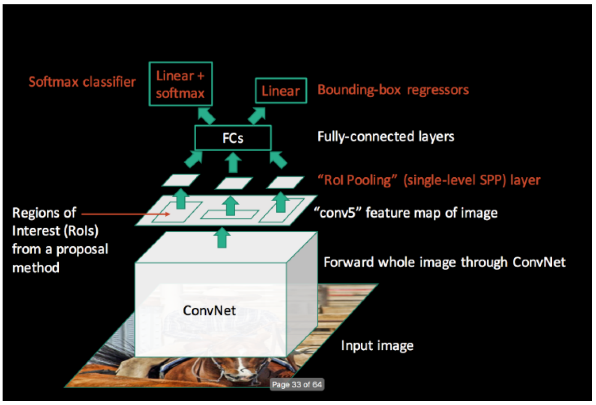  
  <i>Architecture of Fast R-CNN.</i>

The central difference is that the regions of interest are applied to a feature map and not to the original image, reducing the need for multiple networks, one for each region.

### Region Proposal Networks (RPN)
Idea: remove dependence on an external region proposal network or algorithm and instead infer the regions from the same CNN. That is what **Faster R-CNN** does.

  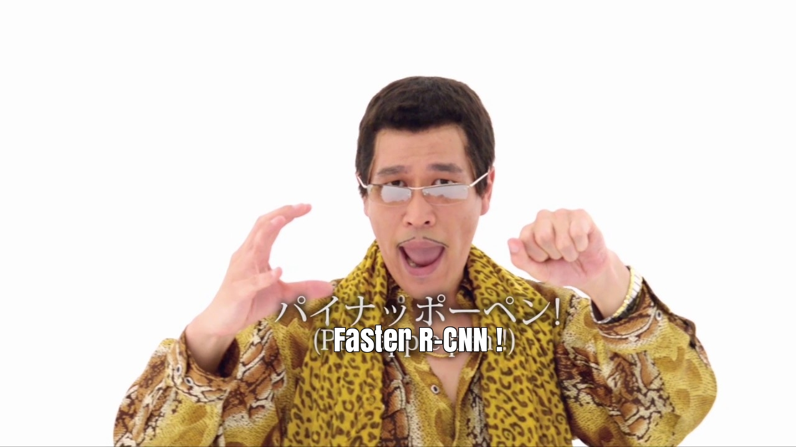  
  <i>Fast R-CNN + RPN = Faster R-CNN</i>

Faster R-CNN uses ROI pooling (see below) and anchors ([see here](https://towardsdatascience.com/anchor-boxes-the-key-to-quality-object-detection-ddf9d612d4f9)) to extract the regions of interest. Furthermore, it uses faster R-CNN for the classification.

> **Region of Interest (ROI) pooling**  
> A major challenge of going from classification to object detection is that the networks used for classification rely on a fixed input image size due to the fully connected layers. To use the **classification networks** we therefore have to generate a **fixed shape input** for them. This is the purpose of ROI pooling layers.  
> This opens up the possiblity of using one feature map to describe a whole scene, and then extracting regions of interests instead of having multiple networks two produce separate feature maps for the regions.

As a consequence, there are 4 losses to minimize; the classification and bounding-box regression loss of each the region proposal network, and the ROI pooling network:

  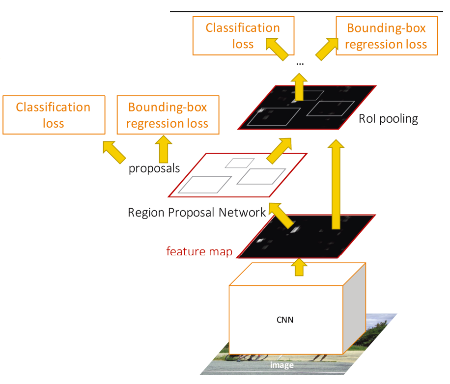

### YOLO: you only look once
- Feature maps of the whole image are created using a CNN.
- The image is dividied into a grid of cells.
- Each grid cell is initialized with an initial anchor (an initial bounding box guess) which is improved as the network iterates. The layer responsible is called *prediction head*.
  Each bounding box has x, y, width, height, and a confidence .
- For each grid cell, C conditional class probabilities are predicted.
- At the end, start to remove bounding boxes:
  1. Find boxes with the greatest confidence
  2. Remove other boxes if the intersection over union (IoU) / overlap is greater than some threshold
  3. Repeat for any remaining boxes

  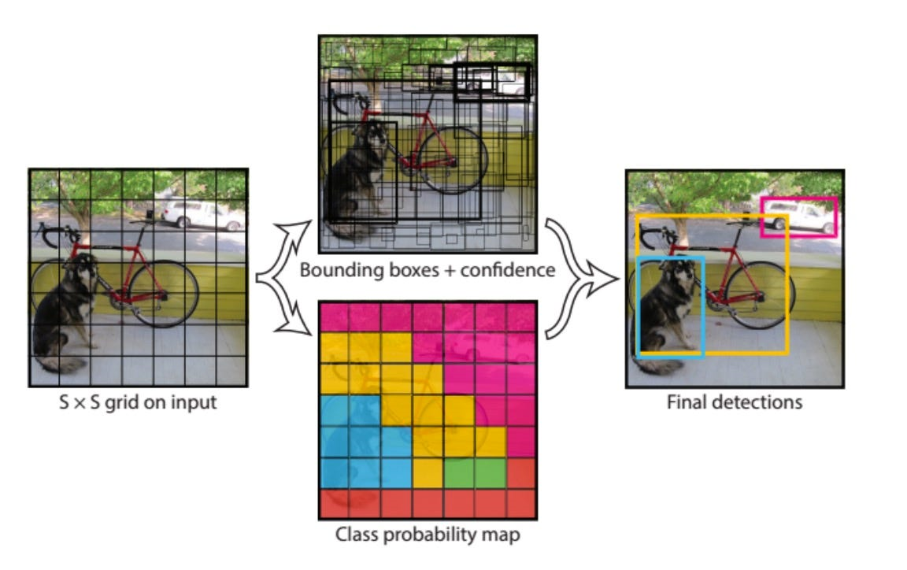

### Feature Pyramid Networks (FPN)
These networks, like some previously mentionened ones, use activations from different layers and combine them with addition.

  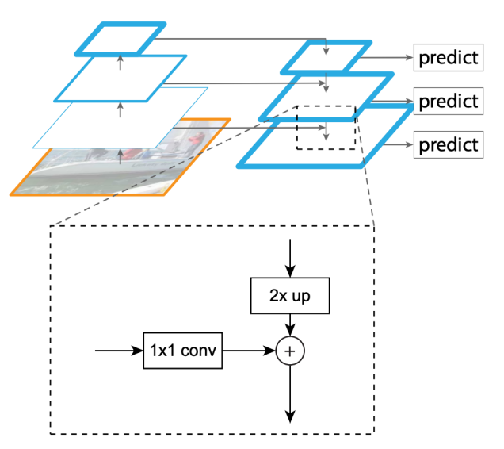

- On each level, anchors of the same scale are assigned. There are, however, anchors of multiple aspect ratios in each level (for ex. 1:2, 3:4, 4:3 etc.). The constant can be kept constant due to the varying perceptive areas of the different levels.
- 5 layers in total
- Labels during training are assigned to the anchors based on the overlap / IoU with the ground truth boxes.
- The training label of an anchor is positive if it has the highest IoU for a given ground truth box, or if the IoU is over some threshold (0.7 in this case).
  If the IoU is under 0.3 the label is negative.

### Overview on state-of-the-art object detection models
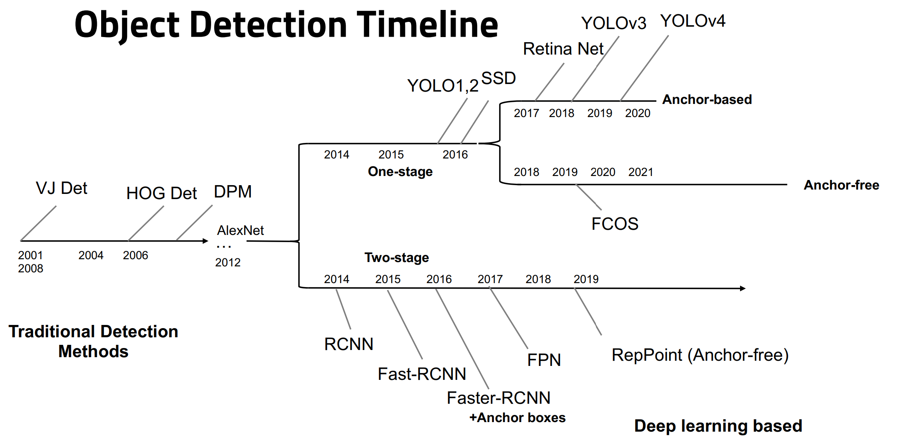

### Instance Segmentation
This extends the task of segmentation to detecting not just classes of different objects but the specifiy instances, for ex. assigning individual labels to individual humans. (&rarr; more difficult than segmentation alone).

### Mask RCNN
This extends Faster R-CNN with a parallel branch for predicitng object mask.
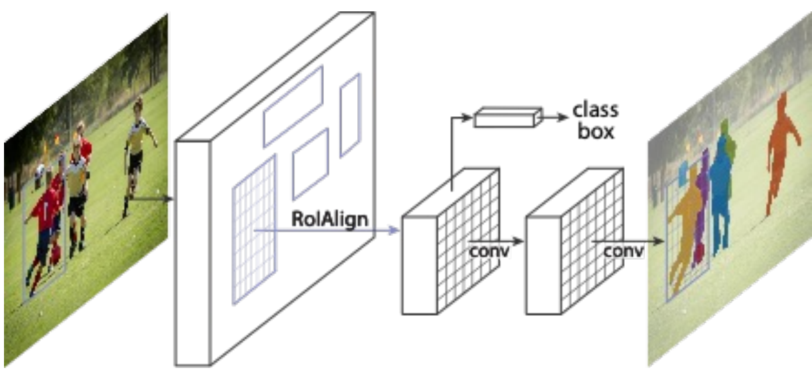

### ROI Align
